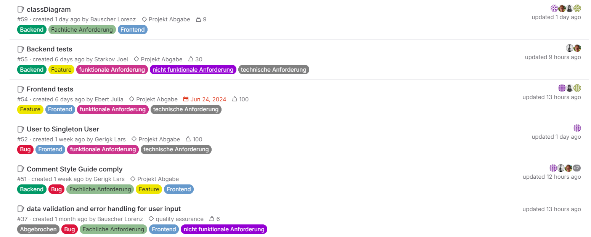

# Anforderungsanalyse

* 0 - Keine Anforderungen dokumentiert
* 1 - Rudimentäre Anforderungen vorhanden
* 2 - Arbeit mit Milestones/Labels
* 3 - Unterteilung der Anforderung (z.B. fachliche/technische Anforderungen), Verknüpfung der Anforderungen untereinander, Verlinkung mit git-Commits

In unserem Projekt verwenden wir systematisch Issues, Labels und Milestones, um unsere Arbeit zu strukturieren. Darüber hinaus teilen wir die Anforderungen in fachliche und technische Kategorien und verknüpfen diese miteinander. Eine detaillierte Beschreibung unseres Vorgehens finden Sie unter [Dokumentationen/Git Workflow](../dokumentationen/git-workflow.md). Zudem können Sie in [GitLab](https://gitlab.mi.hdm-stuttgart.de/lg107/sipster) unsere [Issues](https://gitlab.mi.hdm-stuttgart.de/lg107/sipster/-/issues) einsehen, um unser strukturiertes Vorgehen nachzuvollziehen. Hier noch ein kurzer Einblick mit Beispielen:\

<figure><figcaption></figcaption></figure>
