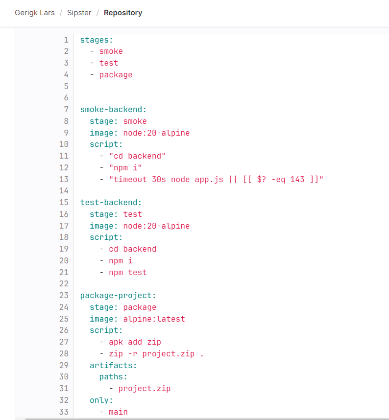

# CI/CD

* 0 - Kein CI/CD vorhanden
* 1 - .gitlab-ci.yml angelegt
* 2 - Build-Lifecycle in .gitlab-ci.yml abgebildet
* 3 - .gitlab-ci.yml so angepasst, dass manche Steps nur bei Bedarf ausgeführt werden. Inkl. Dokumentation mit Begründung.

Da wir in unserem Projekt eine App-Anwendung entwickeln und im Backend Node.js verwenden, konnten wir CI/CD nicht optimal umsetzen. Dennoch haben wir die Anforderungen weitgehend erfüllt. Unsere CI/CD-Pipeline besteht aus drei Stages: `smoke`, `test` und `package`. Die `package`-Stage wird nur bei einem Push oder Merge auf den `main`-Branch ausgeführt.

In der `smoke`-Stage wird die Anwendung für 30 Sekunden gestartet, um sicherzustellen, dass sie problemlos läuft und vom Server gepullt werden kann. Dies ist eher ein Smoke Test als ein vollständiger Build, daher der Name. Dieser Test wird bei jedem Merge oder Push durchgeführt.

In der `test`-Stage werden alle JEST-Tests ausgeführt, um die Funktionalität der wichtigsten REST-Endpunkte und Funktionen zu überprüfen. Auch diese Stage wird bei jedem Push oder Merge durchgeführt.

Die `package`-Stage wird nur bei einem Merge oder Push auf den `main`-Branch ausgeführt. In dieser Stage wird aus dem gesamten Projekt eine .zip-Datei erstellt, die heruntergeladen oder exportiert werden kann. Dies stellt sicher, dass auf dem `main`-Branch immer die neuesten Versionen der App vorhanden sind. Da es nur Sinn macht, diese Stage bei Änderungen auf dem `main`-Branch auszuführen, wird sie nicht bei jedem Push oder Merge durchgeführt, wie die beiden anderen Stages.

Hier noch ein Screenshot unserer .yml- Datei, die im obersten Verzeichnis unseres Projekts zu finden ist:

<figure><figcaption></figcaption></figure>

