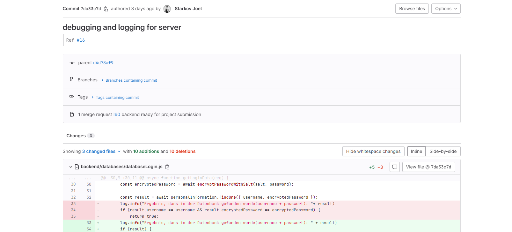

# git

* 0 - Commits ohne Commit-Messages
* 1 - Commits mit Commit-Messages
* 2 - Tags & Changelog vorhanden und gepflegt. Readme vorhanden.
* 3 - git-Vorgehen inkl. branching dokumentiert und angewandt

Unsere Commits verfügen jeweils über Messages, als auch über Tags und Changelogs. Alles kann bei unserem [git repository](https://gitlab.mi.hdm-stuttgart.de/lg107/sipster) nachgeschaut werden. Unser Vorgehen ist unter [Dokumentationen/Git Workflow](../dokumentationen/git-workflow.md) dokumentiert.

Beispiel für einen commit:

<figure><figcaption></figcaption></figure>
