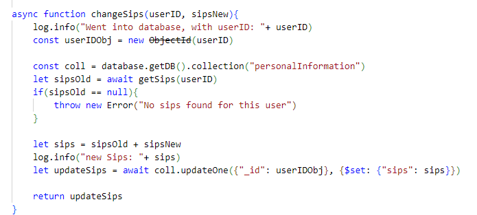
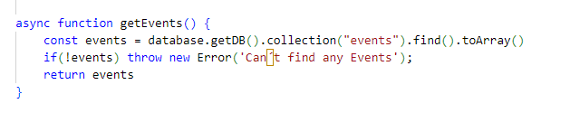
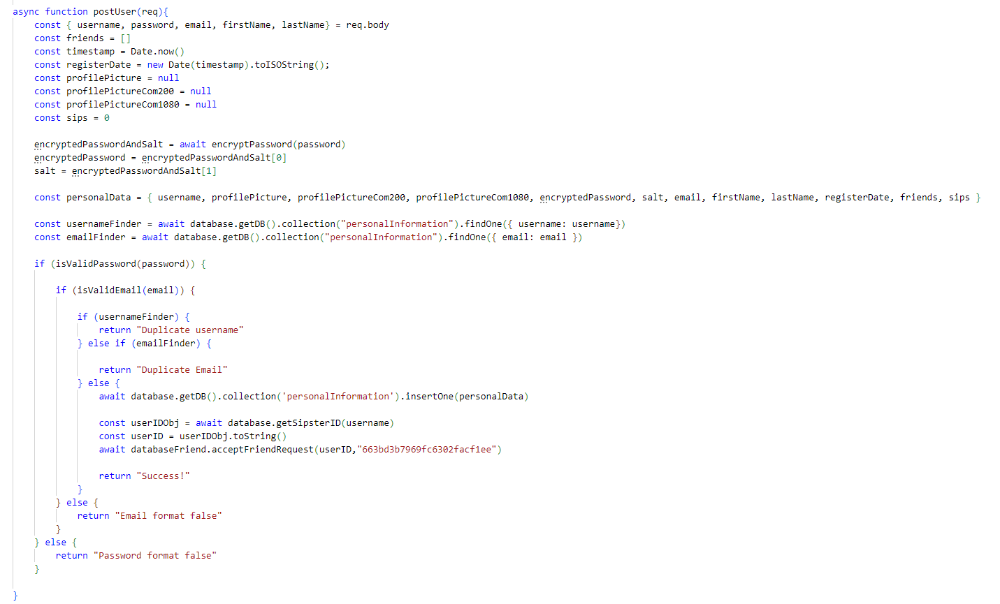
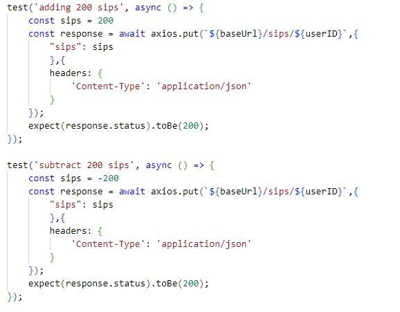

# Persistenz

* 0 - keine Persistenz vorhanden
* 2 - CRUD-Operationen für (No)SQL-DB teilweise implementiert
* 4 - CRUD-Operationen für (No)SQL-DB implementiert & genutzt
* 6 - DB-Operationen in Tests aufgenommen, Bereitstellung von Demo-Daten

Die CRUD- Operationen wurden bei uns im Projekt vollständig implementiert. Zudem gibt es Demo-Daten (TODO). Außerdem werden Datenbank-Operationen ebenfalls von JEST-Tests getestet. Diese sind unter `sipster/backend/tests` auffindbar.

Alle Operationen für die Datenbank sind unter `sipster/backend/databases` zu finden. Es wurden alle Operationen umgesetzt.

Einige Beispiele sind hier als Screenshots dargestellt:

<figure><figcaption>
Methode ist unter sipster/backend/databases/databaseSips zu finden
</figcaption></figure>

<figure><figcaption>
Methode ist unter sipster/backend/databases/databaseEvents zu finden
</figcaption></figure>

<figure><figcaption>
Methode ist unter sipster/backend/databases/databaseRegister zu finden
</figcaption></figure>

<figure><figcaption>
Methoden sind unter /sipster/backend/tests/sips.test.js zu finden
</figcaption></figure>
