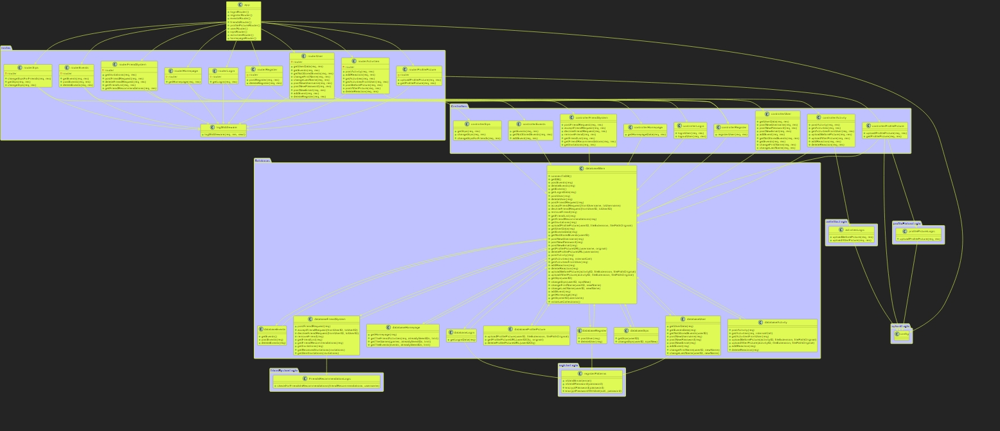

# Softwarearchitektur & Clean Code

* 0 - Keine Softwarearchitektur erkennbar (z.B. keine Packageuntergliederung)
* 1 - Package-Struktur vorhanden und mit Klassendiagramm dokumentiert. Dokumentation und Begründung welches Architekturmuster gewählt wurde.
* 2 - SE2-Themen angewandt: SOLID-Prinzipien angewandt und dokumentiert. Interfaces und Factories sinnvoll eingesetzt.
* 3 - Dokumentation des Codes und Architektur: Dokumentiert wie Komponenten miteinander kommunizieren. Dokumentation der architektonischen Entscheidungen mit Hilfe von ADR (_Architecture Decision Records_, mind. drei). Code-Dokumentationsprinzipen beschrieben und angewandt (nicht erlaubt: Begründung "der Code ist selbsterklärend")

Auch diese Anforderungen haben wir soweit korrekt umgesetzt. Das Klassendiagramm des backends ist im git-repository unter "documentation" zu finden, anbei stelle ich es allerdings auch noch als Screenshot zur Verfügung. Auf die Erstellung eines Klassendiagramms haben wir unter Abspache mit Ihnen verzichtet, da wir leider keine Möglichkeit gefunden haben, dieses automatisiert zu erstellen.

Aufgrund der Programmiersprache von JavaScript war es uns leider nicht möglich Interfaces zu erstellen, da diese in der Programmiersprache nicht vorhanden sind.&#x20;

Die Dokumentation und Begründung, welches Architekturmuster gewählt wurde, kann man unter [Dokumentationen/Architecture Decision Record - ADRs/Nr. 002](../dokumentationen/architecture-decision-record-adrs/nr.-002-verwendung-eines-schichtmodells-in-kombination-mit-einer-microkernel-struktur-als-softwarea.md) finden. Factories finden sich besonders im Frontend. //TODO

Die restlichen zwei ADR's behandeln die Themen "[Verwendung von React Native für die App Entwicklung](../dokumentationen/architecture-decision-record-adrs/nr.-001-verwendung-von-react-native-fur-die-app-entwicklung.md)" und "[Erstellung des Guides zur Nutzung von Changelogs/Tags](../dokumentationen/architecture-decision-record-adrs/nr.-003-erstellung-des-guides-zur-nutzung-von-changelogs-tags.md)" und sind ebenfalls unter [Dokumentationen/Architecture Decision Record - ADRs](../dokumentationen/architecture-decision-record-adrs/) zu finden.

Das Klassendiagramm (leider nicht allzu gute Qualität wegen der Größe des Diagramms):

<figure><figcaption></figcaption></figure>
