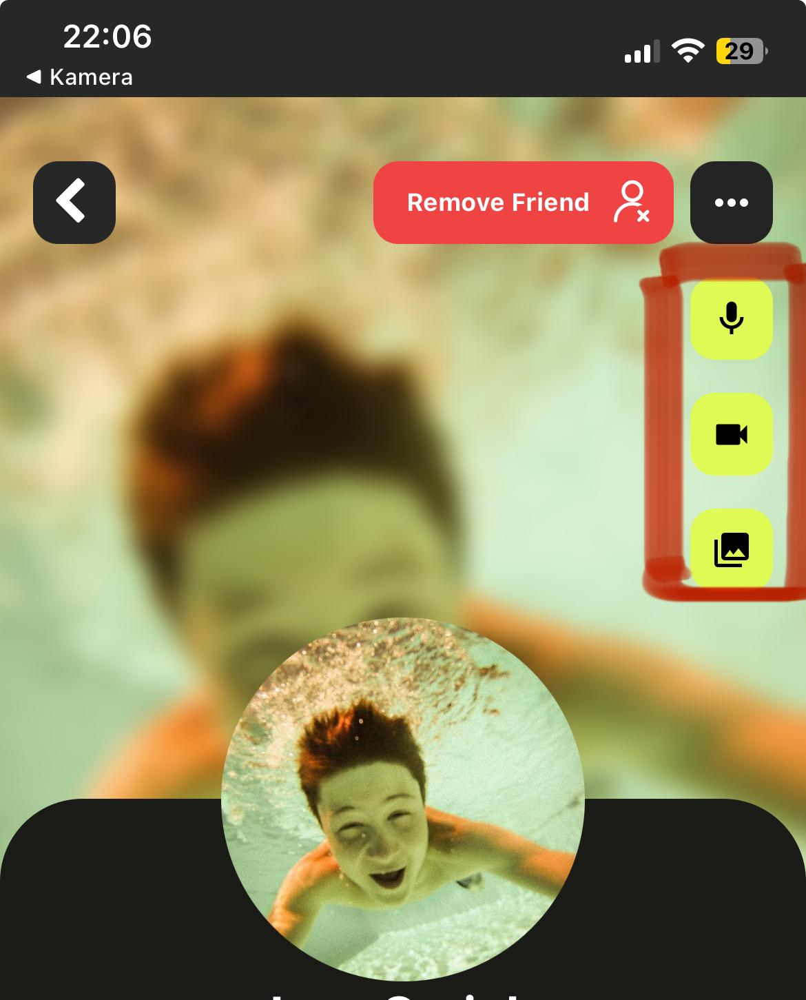

# Fehlende Features und bekannte Fehler

* Aktuell sind die Fehlermeldungen in unserer Software noch nicht detailliert ausgearbeitet. Benutzer erhalten zum Teil nur allgemeine Fehlermeldungen, die nicht spezifisch auf die jeweilige Situation eingehen. In zukünftigen Versionen planen wir jedoch, diese Fehlermeldungen durch spezifische und hilfreiche Pop-Ups zu ersetzen. Diese werden den Benutzern klare und präzise Informationen über die aufgetretenen Probleme bieten und ihnen entsprechende Lösungsvorschläge oder Hinweise geben.
* Das Eventmanagement ist derzeit nur grundlegend implementiert. Aktuell können Benutzer lediglich Events speichern. In zukünftigen Versionen wird das Eventmanagement weiter ausgebaut. Geplant ist, dass nur noch Events angezeigt werden, die noch nicht gespeichert sind. Zudem wird es auf der Event-Seite und der Konto-Seite möglich sein, Events durch Klicken auf "+" und "-" Buttons hinzuzufügen oder zu löschen.
* Die Caption bei einem Post einer Activity zu ändern funktioniert noch nicht bzw. funktioniert noch nicht einwandfrei.
* Die API\`s und Methoden im Backend für die Sips wurden zwar getestet, im Frontend aber noch nicht eingebaut und konnte daher noch nicht ganz auf Ihre vollständige Funktionalität getestet werden.
* Manche Spiele sind noch nicht implementiert, werden allerdings schon angezeigt.
* Sollte ein Spiel beim Ladeprozess abbrechen, liegt das an der Expo Go App, funktioniert aber in der gebuildeten Version einwandfrei.
* In der Friendspage, also wenn man auf das Profil einer Person geht, gibt es verschiedene Buttons, die bis jetzt noch keine Funktion haben.

<figure><figcaption>
Hier sind die Buttons markiert, die bisher keine Funktion haben
</figcaption></figure>

